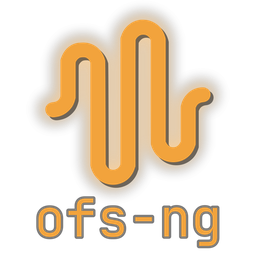

<p align="center">
  
</p>

# ofs-ng

A funscript editor. It pairs libmpv video playback with a multi-axis timeline,
a live simulator, a node-based processing graph, and a C# plugin system.

A complete rewrite of OpenFunscripter in modern C++20, built on largely the same stack —
SDL3, Dear ImGui, OpenGL, and libmpv.

## Features

- **Multi-axis timeline** 
- **Live 3D simulator**
- **Node-based processing graph**
- **C# plugin system**
- **Localized UI**

## Platform support

| Platform | Status |
|----------|--------|
| **Windows** | Fully supported — build, run, and debug. |
| **Linux** | Fully supported — build, run, and debug. |
| **macOS** | Indirect only. The codebase is cross-platform and is expected to build and run, but it is **not directly supported** — we don't build, test, or debug on macOS. |

## Getting the source

The project uses git submodules for its third-party libraries, so clone recursively:

```bash
git clone --recurse-submodules <repository-url>
cd ofs-ng
```

If you already cloned without `--recurse-submodules`:

```bash
git submodule update --init --recursive
```

## Building

ofs-ng builds with CMake. You need:

- A **C++20 toolchain** (MSVC on Windows; GCC or Clang on Linux)
- **CMake** 3.16+
- The **.NET SDK** — required in practice. The build links **NetHost** (located via
  `cmake/FindNetHost.cmake`, sourced from the SDK install), and the C# plugin system and the
  runtime-compiled C# script nodes both depend on it. The plugin and script builds skip
  themselves if `dotnet` isn't found, so a `dotnet`-less build technically completes — but it
  ships none of that functionality and isn't worth running. Treat it as a hard requirement.
- **libmpv** — auto-downloaded on the first Windows build; install via your package manager
  on Linux
- **ffmpeg** and **ffprobe** — used at runtime for video transcoding. Bundled next to the
  executable on Windows; on Linux/macOS they're resolved from `PATH`, so install them with your
  package manager (a single `ffmpeg` package provides both binaries).

```bash
# Configure (use your platform's generator — Visual Studio on Windows, Ninja/Make on Linux)
cmake -S . -B build

# Build
cmake --build build -j 8
```

The executable and its runtime files are written to `bin/`.

## Tests

The test suite runs through CTest (build first, then):

```bash
ctest --test-dir build --output-on-failure
```

It registers four suites: `unit` (no window), `plugins` (PluginManager + real CoreCLR;
self-skips without the .NET SDK), `ui-smoke` (full window + imgui_test_engine), and
`ui-smoke-loc` (the UI suite re-run under a machine translation to catch dropped widget ids).
Run a single suite with `-R`, e.g. `ctest --test-dir build -R ui-smoke --output-on-failure`.

## Plugins

ofs-ng plugins are C# DLLs loaded into the app's .NET runtime — one class deriving from
`OfsPlugin`, with no C ABI or manual marshaling to deal with. The `plugins/` directory holds
the plugin API, the host, and example plugins; **[plugins/StarterPlugin](plugins/StarterPlugin)**
is a ready-to-build template to copy from.

Plugins are managed .NET assemblies (platform-neutral IL). A compiled plugin is tied only to
the `Ofs.Api` version it was built against — not to a specific ofs-ng version — so the same
DLL keeps working across every ofs-ng build that ships a compatible `Ofs.Api`. A rebuild is
needed only when `Ofs.Api` itself changes incompatibly.

## Troubleshooting

### High CPU on NVIDIA GPUs (Windows)

Hint: setting **_Threaded Optimization_ to _Off_** for `ofs-ng.exe` in the NVIDIA Control Panel
(Manage 3D settings → Program Settings) may reduce CPU usage.
